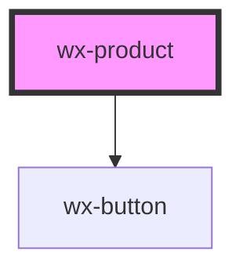

# wx-product

<!-- Auto Generated Below -->

## Properties

| Property             | Attribute              | Description | Type      | Default     |
| -------------------- | ---------------------- | ----------- | --------- | ----------- |
| `price`              | `price`                |             | `number`  | `undefined` |
| `productId`          | `product-id`           |             | `string`  | `undefined` |
| `productTitle`       | `product-title`        |             | `string`  | `undefined` |
| `shoppingList`       | `shopping-list`        |             | `boolean` | `false`     |
| `shoppingListAmount` | `shopping-list-amount` |             | `number`  | `undefined` |
| `shortDescription`   | `short-description`    |             | `string`  | `undefined` |

## Events

| Event                    | Description | Type               |
| ------------------------ | ----------- | ------------------ |
| `addToShoppingList`      |             | `CustomEvent<any>` |
| `removeFromShoppingList` |             | `CustomEvent<any>` |

## Dependencies

### Depends on

- [wx-button](../wx-button)

### Graph

----------------------------------------------

*Built with [StencilJS](https://stenciljs.com/)*
